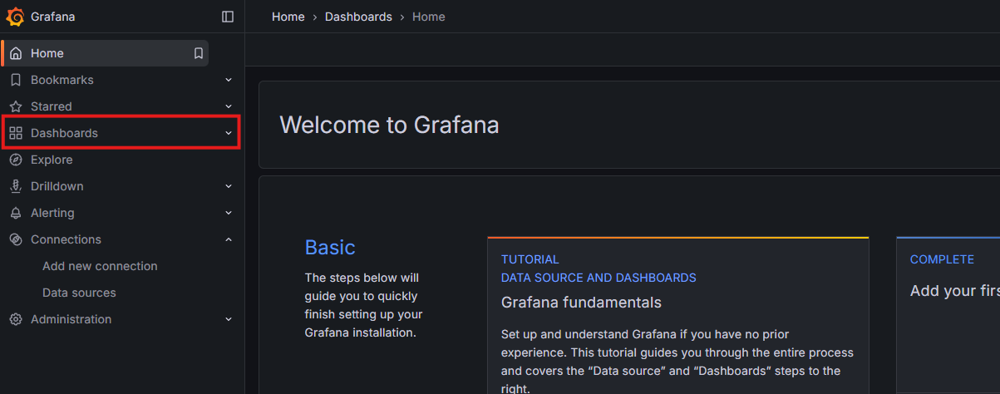
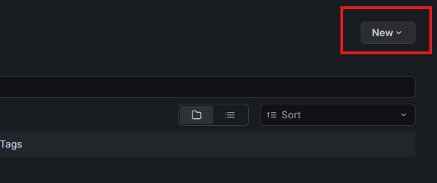
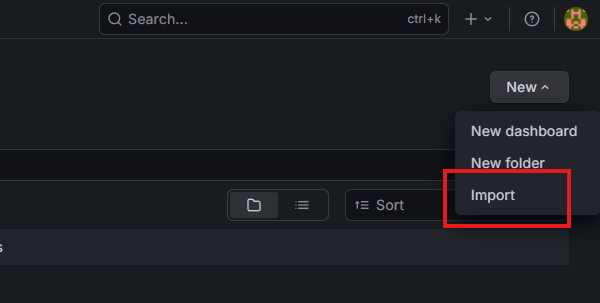

# Monitoring Tools Setup Guide

This project provides a set of monitoring tools used in the **INT531 Site Reliability Engineering** course.

---

## 🚀 Installation Guide

### 1. Install Node Exporter

Download the latest Node Exporter release from the official Prometheus website:

🔗 https://prometheus.io/download/#node_exporter

#### 1.1. Download the Linux release

_Example screenshot:_  


#### 1.2. Run the following commands

> ⚠️ **Important:** Replace `<VERSION>`, `<OS>`, and `<ARCH>` with the correct values shown on the download page.

```bash
# Download the Node Exporter tar.gz file
wget https://github.com/prometheus/node_exporter/releases/download/v<VERSION>/node_exporter-<VERSION>.<OS>-<ARCH>.tar.gz

# Extract the archive
tar xvfz node_exporter-*.*-amd64.tar.gz

# Move into the extracted directory
cd node_exporter-*.*-amd64

# Start Node Exporter
./node_exporter
```

### 📦 2. Start the Monitoring Stack (Prometheus + Grafana)

After installing Node Exporter, start the monitoring stack using Docker Compose:

```bash
docker compose -f monitoring.compose.yml up -d
```

# 📊 Grafana Setup Guide

### 1. Log in to Grafana

Default credentials:

Username: `admin`

Password: `admin`

### 2. Open the Dashboards Menu

Go to the Dashboards section in the left sidebar.



### 3. Click the “New” button

This button is near the top-right corner.



### 4. Select Import from JSON file

Grafana allows you to import dashboards .




### 5. Upload the Dashboard JSON

Upload the file from: `grafana/dashboard`
